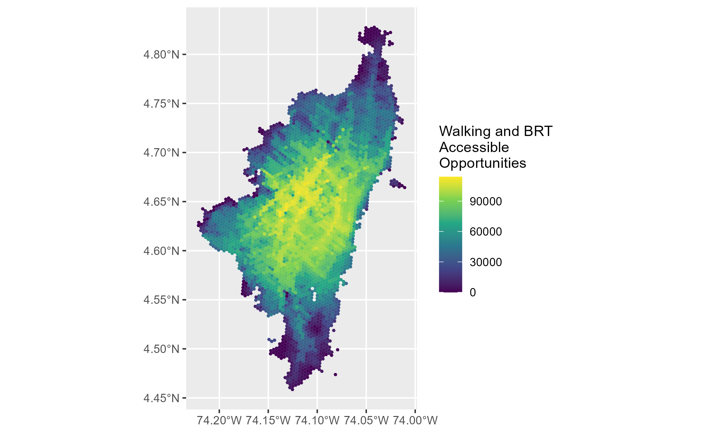
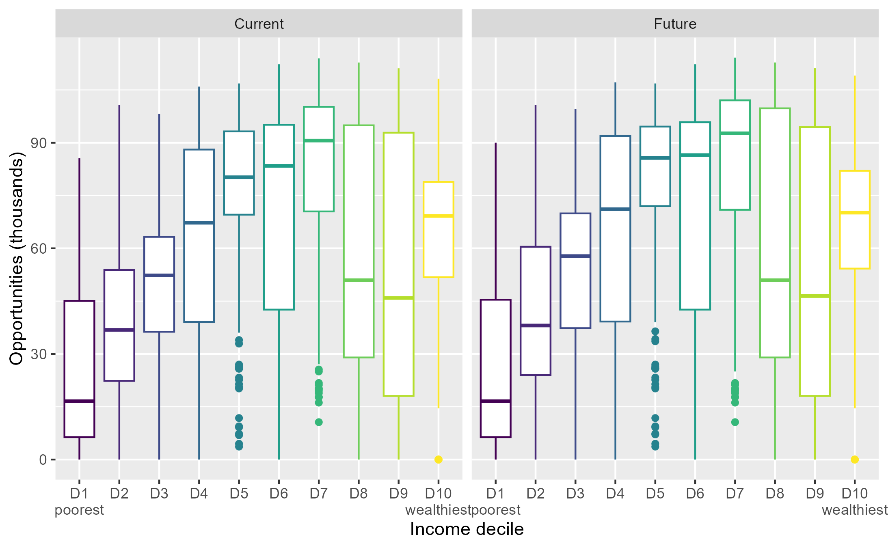

# Accessibility impact of transport infrastructure: Spatial assessment of Bogotá's future metro

Author: [Andrés Restrepo Jiménez](https://www.linkedin.com/in/andres-restrepo-jimenez/)

Repo containing code of dissertation from MSc Urban Spatial Science at [The Bartlett Centre for Advanced Spatial Analysis](https://www.ucl.ac.uk/bartlett/casa/) of [University College London](https://www.ucl.ac.uk/).

The code support a academic research exercise to spatially (geographically) assess the impact of the new metro system of Bogotá, Colombia in terms of accessibility to economic activity (job opportunities). A novel feature of the study was the creation of the transit specification for the metro service in GTFS format, considering that the first line is supposed to start operations in 2028.

Full document available [here](https://www.researchgate.net/publication/377531023_Accessibility_impact_of_transport_infrastructure_Spatial_assessment_of_Bogota's_future_metro_system)

## Sections
The script is divided in the following sections:

1. Bus Rapid Transit (BRT) network
1. OSM network (Pedestrian network)
1. Metro system (GTFS data generation)
1. Multipurpose survey (Socioeconomic data)
1. Land use (Job opportunities)
1. Accessibility modelling
    1. Walking only mode
    1. Base (before) scenario: BRT + walking mode
    1. Control scenario: Metro + walking mode
    1. Future (after) scenario: BRT + metro + walking mode
    1. Time travel matrix
    1. Parameters
1. Results assessment
    1. By income decile

## Results

